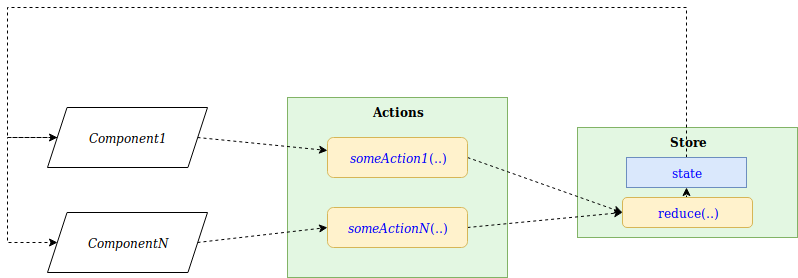
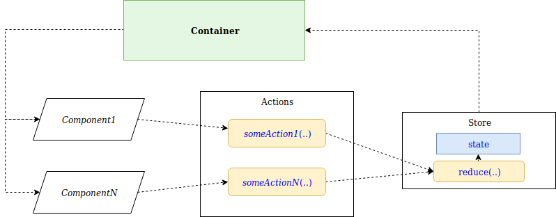
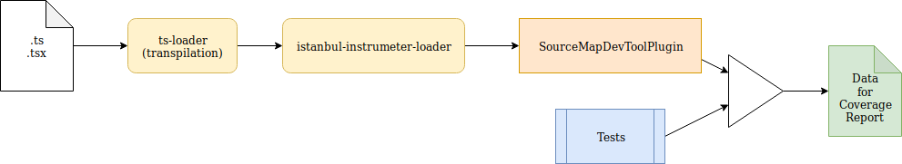

# Base Code for Typescript Ionic React App

[](/LICENSE.txt)  

**This project is build with the purpose of given a base code from where to start developing a Ionic React app with little effort.**

This project is licensed under the terms of the [MIT license](/LICENSE.txt).
__________________

## Quick Start

1. Clone (or download) the project, run:  
 `git clone https://github.com/gmullerb/basecode-ts-ionic-react`  
  or  
 `git clone https://gitlab.com/gmullerb/basecode-ts-ionic-react`  

2. Run `./gradlew` to install npm dependencies and to check the project.

3. Run `./gradlew run`: to run the project.

4. Open browser at `localhost:4200`.

5. Jump to [Inside the Code](#Inside-the-Code).

__________________

## Goals

* Provide a "well" documented base code from where to start developing [Ionic](https://ionicframework.com/) [React](https://reactjs.org/) [1].
  * "Well" documented in order to ease customization of this start point.
* Provide basic React elements: Flux, Router.
* Be untie as possible from Angular CLI [2].
* Test code without typings [3].

Some things may be Opinionated based on best practices and professional experience [4].

> [1] This project does not include native (e.g. cordova), for that go to [basecode-ts-ionic-native-react project](https://github.com/gmullerb/basecode-ts-ionic-native-react).  
> [2] Used for building, serving and e2e testing, currently [Ionic](https://ionicframework.com/) team is working in an "agnostic" approach.  
> [3] Main code use [Typescript](https://www.typescriptlang.org/), but some extra configuration changes can be done in order to use [Flow](https://flow.org/) can be used.  
> [4] Some topics in the README files have _References_ so you can dig more on details. And code has been "widely" documented to assist you to understand some fragments.  

## Features

* All in 1 project.
* Code Style Checking.
  * for Project code (Javascript, Typescript & React).
  * for Build code (Gradle) [1].
* Test Driven Development.
  * Unit, Integration and End to end tests.
  * Code coverage checking.

> [1] [Gradle](https://gradle.org/) will allow to have "really" isolated different Node/Npm environments for different projects, but npm or yarn can be used.

### Tools been used

* Building.
  * [Gradle](https://www.java.com).
    * [Node plugin](https://plugins.gradle.org/plugin/com.moowork.node).
  * [npm](https://www.npmjs.com/).
* Code Style Checking.
  * Javascript: [ESlint](https://eslint.org).
  * Typescript: [TSlint](https://palantir.github.io/tslint).
  * CSS: [StyleLint](https://github.com/stylelint/stylelint)
  * Gradle: [CodeNarc](http://codenarc.sourceforge.net).
* Test Driven Development.
  * Unit Test & Integration Test:
    * [Jasmine](https://jasmine.github.io)
    * [Enzyme](https://airbnb.io/enzyme)
    * [Karma](https://karma-runner.github.io).
  * End to end tests:
    * [Protractor](http://www.protractortest.org).
  * Code coverage checking.
    * [Istanbul](https://istanbul.js.org).

## Prerequisites

* [Java](https://www.java.com/en/download/help/download_options.xml) (for running Gradle) [1].
* [Git](https://git-scm.com/downloads) (only if the project is going to be cloned).
* [Chromium](https://www.chromium.org/) or [Chrome](https://www.google.com/chrome/browser/desktop/) for Tests.

> [1] Usually comes with every operating system, [Gradle](https://gradle.org/) will allow to have "really" isolated different Node/Npm environments for different projects, but npm or yarn can be used.

## Getting it

Clone or download the project[1], in the desired folder execute:

```sh
git clone https://github.com/gmullerb/basecode-ts-ionic-react
```

or

```sh
git clone https://gitlab.com/gmullerb/basecode-ts-ionic-react
```

> [1] [Cloning a repository](https://help.github.com/articles/cloning-a-repository/)

## Set up

+ **No need**, only download and run (It's Gradle! Yes!) [1].

> [1] `npm` or `yarn` can be used.

## Running it

### Node/Npm scripts

Npm scripts are defined in [package.json file](package.json):

* `assemble`: will build the project.
* `e2e`: runs E2E tests.
* `main-lint`: will assess Main code using tslint.
* `run`: runs Project.
* `test`: runs Tests (Unit & Integration tests).

> `gradle-*` scripts should not be run from npm, since some external files are download from the web, use the respective Gradle task.

### Gradle tasks

Gradle tasks are defined in [build.gradle file](build.gradle).

This project uses the Gradle Tasks structure define by plugin [`all.shared.gradle.code-common-tasks`](https://github.com/gmullerb/code-common-tasks#tasks--groups), which define a set of tasks and dependencies:

* `build`
  * `check`
    * `assess`
      * `assessMain`
      * `assessTest`
    * `test`
  * `assemble`

[Gradle Tasks structure Diagram](https://github.com/gmullerb/code-common-tasks/blob/master/readme/tasksDiagramNotUnitOrIntegrationTasks.png)
(without `doc` task)

Additionally this project define some additional tasks:

* `assessStyleConfig`: will assess Project JS configuration files using eslint (with rules from [base-style-config](https://github.com/gmullerb/base-style-config/blob/master/src/config/front/.eslintrc.json)).
* `assessStyleMain`: will assess Main source code using tslint.
* `assessStyleCss`: will assess CSS files using stylelint (with rules from [base-style-config](https://github.com/gmullerb/base-style-config/blob/master/src/config/front/.stylelintrc.json)).
* `assessStyleTest`: will assess Test source code files using eslint (with rules from [base-style-config](https://github.com/gmullerb/base-style-config/blob/master/src/config/front/.eslintrc.json)).
* `assessStyleE2e`: will assess E2E Test source code files using eslint (with rules from [base-style-config](https://github.com/gmullerb/base-style-config/blob/master/src/config/front/.eslintrc.json)).
* `e2e`: runs E2E Tests.
* `run`: runs Project.
  * Go to the web browser look at the url: http://localhost:4200/.

`./gradlew tasks --all`: will list all available tasks for the project.

* `gradlew`, will run default tasks [1]:
  * [`assessGradle`](https://github.com/gmullerb/project-style-checker#features): will assess Gradle files.
  * [`assessCommon`](https://github.com/gmullerb/project-style-checker#features): will assess All files.
  * `npmInstall`: will install npm dependencies [2].
  * `assessStyleConfig`.
  * `build`.
  * `e2e`.

[1] Mainly the tasks that should be run before pushing the code to a repository.  
[2] If dependencies in `package.json` are modified `./gradlew npmInstall` should be run.

### Gradle Tasks & Node Scripts

Some Gradle tasks match with Node scripts:

* `assessStyleConfig` task runs `gradle-config-lint` script.
* `assessStyleMain` task runs `main-lint` script.
* `assessStyleCss` task runs `gradle-style-lint` script.
* `assemble` task runs `assemble` script.
* `assessStyleTest` task runs `gradle-test-eslint` script.
* `test` task runs `test` script.
* `assessStyleE2e` task runs `gradle-e2e-lint` script.
* `e2e` task runs `e2e` script.
* `run` task runs `run` script.

### Dependencies & Versions

Main project dependencies and versions are defined in [package.json file](package.json) [1]. Some versions are defined in [`gradle.properties`](gradle.properties) file [2]:

* NODE_VERSION: Version of Node
* BASE_STYLE_CONFIG_VERSION: Version of [base-style-config](https://github.com/gmullerb/base-style-config), basically for `eslint` and `stylelint` rules.
* CHECKSTYLE_VERSION: Version of Checkstyle, for common assesses
* CODENARC_VERSION: Version of Codenarc, for assessing Gradle files.

> [1] Change versions: Some versions may be set to the latest using `*` or `+`, so it can get the latest version the first time the project is started,  although is recommended to set it to fixed values later. Some test dependencies may remain dynamic since this will not affect production build, and allow to have latest improvements and fixes.  
> [2] Remember to change the root project name in [settings.gradle](settings.gradle), even in single project builds set rootProject.name = 'name' to avoid Continuous Integration servers issues.
__________________

## Inside the Code

### General Conventions

* Folder `src/main`: Folder of Main source code.
* Folder `src/test`: Folder of Test source code.
* Folder `build`: is a generated folder where build results are placed and also tests and coverage reports.
* Folder's name may use `_`, but not `-`.
* Files' name may use `-`, but not `_`.
* Test (Unit & Integration) Files name ends with `.test.js`.
* E2E Test Files name ends with `.e2e.js`.
* Throughout any documentation, `..` will represent an ellipsis to avoid possible confusion with `...` programming language operator.

### Folder structure

Structure:

```
  /config
    /e2e
    /main
    /test
    /typings
  /src
    /e2e
    /environments
    /main
      /assets
      /back
      /front
    /test
      /back
      /front
    /theme
```

* `config`: Configuration files.
  * `e2e`: Configuration files for E2E tasks.
  * `main`: Configuration files for Main tasks.
  * `test`: Configuration files for Test tasks.
  * `typings`: Additional typings require in the project.
* `src`: Source code.
  * `e2e`: E2E source code.
  * `environments`: Additional environment variables depending on Target (development, production, etc.).
  * `main`: Main source code.
    * `assets`: Main assets.
    * `back`: Non-Visual Main source code.
    * `front`: Visual Main source code.
  * `test`: Main source code.
    * `back`: Test source code for Non-Visual Main source code.
    * `front`: Test source code for Visual Main source code.
  * `theme`: Basically for Ionic theme assets.

### Ionic configuration for React

#### Building tools

Since this project use a stable `@ionic/angular` [1] two major things occurs:

- The project is tie to [Angular Cli](https://cli.angular.io/) [1] (Which is mainly a **hard-coded** wrapper for building tools). Thereupon the project must work with [`angular.json`](angular.json) (Main configuration point of Angular Cli).
- The project is tie to Typescript.

Settings:

* Since it is hard-coded it is a little difficult to do some modifications, but this project use [mutable-webpack-angular-builder](https://github.com/gmullerb/mutable-webpack-angular-builder) which mainly allows to easily customize the webpack configuration. This is done on the [webpack.config.mutator.js](config/main/webpack.config.mutator.js), which must be added as a field in the `options` field of the `build` architect [2] of the `angular.json`:

```json
    "build": {
      "builder": "mutable-webpack-angular-builder:browser",
      "options": {
        "mutatorFile": "./webpack.config.mutator.js",
```

> [1] Hoping at some point to remove this dependency.  
> [2] Some Angular CLI predefined architectures were removed (`test`, `lint`, etc.) to give the project all the freedom that is possible, in order to be easily customized with **transparent** package.json scripts (nothing is hide behind the curtain) .

##### Webpack configuration

In the [webpack.config.mutator.js](config/main/webpack.config.mutator.js), React configuration is done:

1 . Basically Webpack module rules are defined:

a. `reactRule` for processing `.tsx` files:

```js
  const reactRule = {
    test: /\.tsx$/,
    use: {
      loader: "babel-loader",
      options: {
        presets: ["@babel/preset-react", "@babel/preset-typescript"]
      }
    }
  }
```

b. `cssRule` to been able to import `.css` files:

```js
  const cssRule = {
    test: /\.css$/,
    use: [
      'style-loader',
      { loader: 'css-loader',
        options: {
          modules: true,
          importLoaders: 1,
          sourceMap: true
        }
      },
      'postcss-loader'
    ]
  }
```

2 . Webpack configuration is modified:

a. Conflicting rules are **totally** removed [1]:

```js
  const filteredRules = sourceWebpack.module.rules.filter(
    (rule) => !rule.test instanceof RegExp || !rule.test.test('.css')
  )
```

b. Previously created rules are added:

```js
  filteredRules.push(reactRule)
  filteredRules.push(cssRule)
```

> [1] Thanks to [mutable-webpack-angular-builder](https://github.com/gmullerb/mutable-webpack-angular-builder).

##### package.json scripts

Some tasks are defined using "**transparent**" [`package.json`](package.json) tasks:

* `"gradle-config-lint": "eslint --config ${npm_config_eslintConfigFile} --color config/**/*.js"`: assesses Project JS configuration files,
* `"gradle-e2e-lint": "eslint --config ${npm_config_eslintConfigFile} --color src/e2e/**/*.js"`: assesses E2E JS files,
* `"gradle-style-lint": "stylelint --config ${npm_config_stylelintConfigFile} \"src/main/front/**/*.css\""`: assesses CSS files,
* `"gradle-test-eslint": "eslint --config ${npm_config_eslintConfigFile} --color src/test/**/*.js"`: assesses Project configuration files,
* `"main-lint": "tslint src/main/**/*.ts?"`: assesses Typescript files [1],
* `"test": "karma start config/test/karma.conf.js --colors"`: runs Tests.

What is kept from Angular Cli?

* `"assemble": "ng build"`: will build the project.
* `"e2e": "ng e2e"`: runs Project.
* `"run": "ng serve"`: runs E2E tests.

### App Structure

* App uses [Flux](https://facebook.github.io/flux/docs/overview.html).
* App uses [React Router](https://reacttraining.com/react-router/web/guides/quick-start).

Singletons are defined in the `src/main/back/singletons`:

* [`mainActions.js`](src/main/back/singletons/mainActions.ts): Where the set of Actions available for the App are defined.
* [`mainStore.js`](src/main/back/singletons/mainStore.ts): Where the reducer function is defined and state is updated based on received Actions.



[`RoutedContainer.tsx`](src/main/back/RoutedContainer.tsx): Here is where the Flux + Router magic happens:

* It is basically a *unusual* React [`Component`](), it **does not have props** but it **does have state**.
  * The state points to the groups of stores, in this case only one, [`mainStore.js`](src/main/back/singletons/mainStore.ts).
* It draws the [`MainComponent.tsx`](src/main/front/MainComponent.tsx).
* It contains the [`BrowserRouter`](https://reacttraining.com/react-router/web/api/BrowserRouter) and the different routes [`Route`](https://reacttraining.com/react-router/web/api/Route).
  * As it is been implemented, the order of the routes are important.

The Container constitutes the bridge between the Store and Components:



#### Ionic

Ionic is basically a set of predefined controls and styles.

1 . Use ionic components directly as any JSX element:

[`SecondaryComponent.tsx`](src/main/front/SecondaryComponent.tsx) fragment:

```js
  const Secondary = () => (
    <div>
      <ion-card>
          <ion-card-header>
              <ion-card-title id='test'>Base Code for Ionic React App</ion-card-title>
              <ion-card-subtitle>Secondary</ion-card-subtitle>
          </ion-card-header>
          <ion-card-content>
            <Link to='/'>
              Switch
            </Link>
          </ion-card-content>
      </ion-card>
    </div>
  )
```

2 . Add any `ion-*` typing that is not defined in [`ionic-declarations.d.ts`](config/typings/ionic-declarations.d.ts).

```js
  'ion-chip': React.DetailedHTMLProps<any, any>
```

When using CSS imported classes, use `class` attribute for Ionic elements and `className` for the rest:

[`MainComponent.tsx`](src/main/front/MainComponent.tsx) fragment:

```js
  <ion-card-header>
      <ion-card-title id='test'>The Ionic React App</ion-card-title>
      <ion-card-subtitle
        text-uppercase
        class={styles.theText}
      >
        {this.props.text}
      </ion-card-subtitle>
  </ion-card-header>
  <ion-card-content>
      <div
        className={styles.theInput}
      >
        <ion-input
          color='secondary'
          padding
          ref={(element: any) => this.textInput = element}
          type='text'
          placeholder='some input'
        />
      </div>
```

> Remember: any imported `.css` will require a `.d.ts` file, e.g.: [`MainComponent.css.d.ts`](src/main/front/MainComponent.css.d.ts)

#### Tests

Tests are presented as a starting point, i.e. tests may not cover all possible cases, neither Unit & Integration tests, nor E2E tests.

> Only `back` code has 100% coverage.  
> Coverage thresholds should be raise and/or sets to the specific project needs.

##### Unit & Integration Test

Test Files name ends with `.test.js` and are written using [jasmine](https://jasmine.github.io) and [enzyme](https://airbnb.io/enzyme) and run with [karma](https://karma-runner.github.io) [1].

Configuration is defined in: [karma.conf.js](config/test/karma.conf.js)

* Four reporters are set:
  * `html` an additional report.
  * `mocha` for console report.
  * `junit` mainly for CI.
  * `coverage-istanbul` for coverage.

* If working as a root, then use No-sandbox Chrome [2]:

```js
    browsers: [ 'ChromeHeadlessNoSandBox' ],
    customLaunchers: {
      ChromeHeadlessNoSandBox: {
        base: 'ChromeHeadless',
        flags: ['--no-sandbox']
      }
    },
```

Code coverage report requires [3]:

1. The use `istanbul-instrumenter-loader` to instrument code for istanbul coverage report.
2. The generation of source map in the transpiler, [tsconfig.test.json](config/test/tsconfig.test.json): `"sourceMap": true`.
3. The use Webpack `SourceMapDevToolPlugin`.



> [1] A mix of unit and integration tests is done, could be separated as is done in [basecode - front](https://github.com/gmullerb/basecode/tree/master/front), but may be out of the scope of this project intention.  
> [2] This can be set even if not running tests as a root, useful for Local and CI.  
> [3] Due to transpilation [Typescript +  Webpack].

##### E2E

E2E Test Files name ends with `.e2e.js` and are written using [jasmine](https://jasmine.github.io) and [protractor](http://www.protractortest.org).

Configuration is defined in: [protractor.conf.js](config/e2e/protractor.conf.js)

* E2E tests with Protractor requires `browser.ignoreSynchronization = true` to allow e2e for **non-angular apps**.
* Two reporters are set:
  * `SpecReporter` from jasmine-spec-reporter is set for console report.
  * `JUnitXmlReporter` from jasmine-reporters for XML report, mainly for CI.
* Headless chrome can be used, if desired:

```js
    capabilities: {
      browserName: 'chrome',
      chromeOptions: {
        args: [ '--headless' ]
      }
    }
```

* If working as a root, then use No-sandbox Chrome [1]:

```js
    capabilities: {
      browserName: 'chrome',
      chromeOptions: {
        args: [ '--no-sandbox' ]
      }
    }
```

> [1] This can be set even if not running e2e as a root, useful for Local and CI.

#### Types

The only code with typings is Main source code, all the remaining code (configuration and testing) does not require typings (seems unnecessary and in some cases can be painful or harmful), but the remaining code style is checked ([eslint]((https://eslint.org))).

## Documentation

* [`CHANGELOG.md`](CHANGELOG.md): add information of notable changes for each version here, chronologically ordered [1].

> [1] [Keep a Changelog](http://keepachangelog.com)

## License

[MIT License](/LICENSE.txt)

## Remember

* Use code style verification tools => Encourages Best Practices, Efficiency, Readability and Learnability.
* Start testing early => Encourages Reliability and Maintainability.
* Code Review everything => Encourages Functional suitability, Performance Efficiency and Teamwork.

## Additional words

Don't forget:

* **Love what you do**.
* **Learn everyday**.
* **Learn yourself**.
* **Share your knowledge**.
* **Learn from the past, dream on the future, live and enjoy the present to the max!**.

At life:

* Let's act, not complain.
* Be flexible.

At work:

* Let's give solutions, not questions.
* Aim to simplicity not intellectualism.
